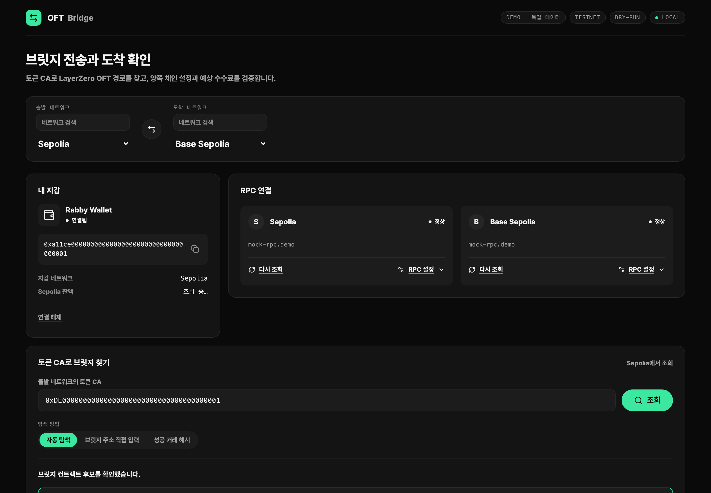
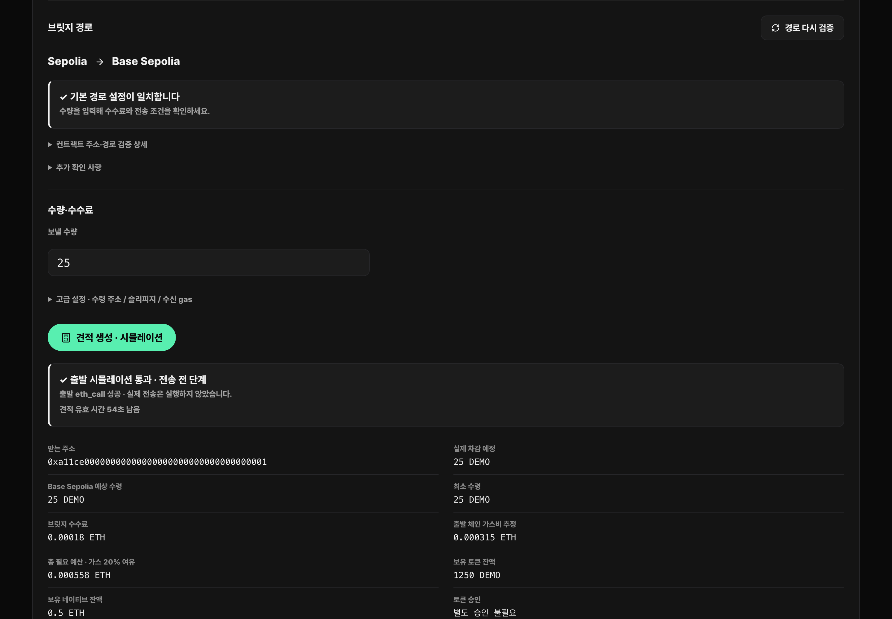
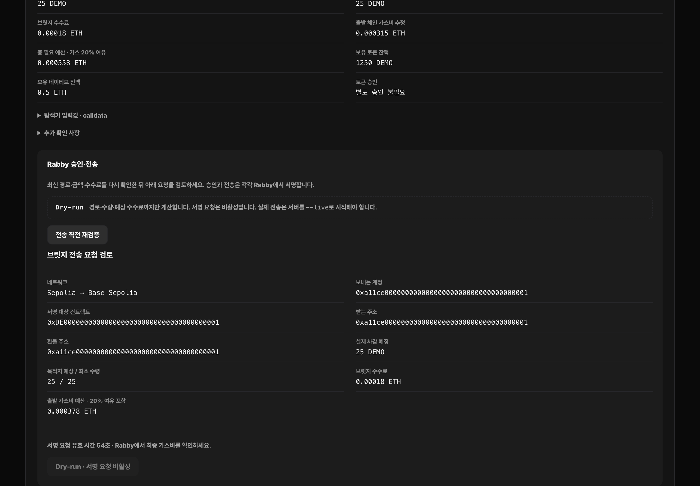
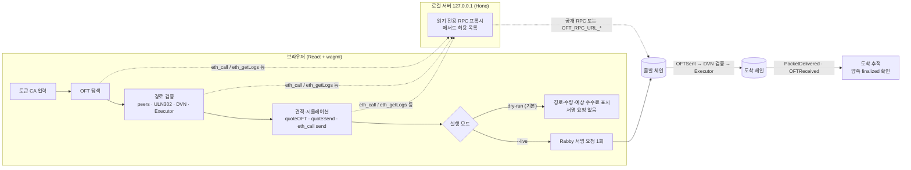

# OFT Bridge

> 프론트엔드가 없는 LayerZero V2 OFT 토큰의 경로를 온체인에서 직접 검증하고, 기본값 **dry-run**으로 수수료까지 계산하는 로컬 브릿지 대시보드.

**데모:** https://geraoft-bridge.com

> [!WARNING]
> **감사(audit)받지 않은 코드입니다. 사용 책임은 전적으로 사용자에게 있습니다.**
> 기본 실행은 테스트넷 + dry-run(서명·전송 없음)입니다. 메인넷과 실제 전송은 각각 `--mainnet`, `--live`를 명시해야만 켜집니다. 실자산을 보내기 전에 코드를 직접 검토하고 소액으로 시험하세요.



| 경로 검증과 견적 | dry-run 전송 검토 |
|---|---|
|  |  |

스크린샷은 목업 데이터로 동작하는 정적 데모 빌드입니다. 주소는 모두 합성 값(`0xa11ce…`, `0xDE00…`)이며 실제 지갑·잔고가 아닙니다.

## 무엇을 하나

Stargate 같은 프론트에 표시되지 않는 OFT는 브릿지 컨트랙트 주소, peer 설정, DVN 구성, 수수료를 직접 확인해야 합니다. 이 앱은 그 과정을 자동화합니다.

1. **탐색**: 토큰 CA에서 OFT/OFTAdapter를 찾습니다. 공식 메타데이터 목록, 직접 입력, 과거 성공 거래(송신 `OFTSent`, 수신 `PacketDelivered`+`OFTReceived`+GUID 재계산)를 근거로 씁니다.
2. **경로 검증**: 양쪽 체인의 `peers`, Endpoint·Send/Receive ULN302 라이브러리, DVN 구성(Dead DVN 차단), Executor, enforced options를 읽습니다. 이 값을 고정한 공식 배포 프로필과 대조합니다.
3. **견적·시뮬레이션**: `quoteOFT`/`quoteSend`를 같은 블록에서 읽고, `send`를 `eth_call`로 시뮬레이션합니다. 가스 추정에는 OP Stack L1 데이터 비용을 포함합니다.
4. **dry-run 검토**: 여기까지는 전부 읽기 전용입니다. 기본 모드에서는 서명 버튼이 비활성입니다.
5. **실행(`--live` 전용)**: 검토한 요청과 바이트 단위로 같은 트랜잭션만 Rabby에 한 번 요청합니다. 요청 전에 이력을 IndexedDB에 먼저 예약해 탭 간 중복 전송을 막습니다.
6. **도착 추적**: 출발 `OFTSent`, LayerZero Scan, 목적지 `OFTReceived`/토큰 `Transfer`/수령량을 대조하고, 양쪽 `finalized` 블록까지 확인해야 완료로 표시합니다.

## OFT 브릿지 흐름



## 지원 체인

| 모드 | 선택 방법 | 체인 |
|---|---|---|
| **테스트넷 (기본)** | 없음 | Sepolia (EID 40161), Base Sepolia (40245), Arbitrum Sepolia (40231) |
| 메인넷 | `--mainnet` 또는 `OFT_NETWORK=mainnet` | LayerZero V2 EVM 111개 등록. 출발 수수료 모델을 검토한 56개(standard 35 · OP Stack 13 · Arbitrum 8)에서 전송 가능하고, 55개는 조회 전용 |

체인 목록과 Endpoint·라이브러리·Dead DVN·Executor 주소는 [LayerZero 공식 메타데이터](https://metadata.layerzero-api.com/v1/metadata)에서 `scripts/generate-chain-registry.mjs`로 생성해 고정합니다(`shared/chain-registry*.json`). 실행 시점의 메타데이터가 고정값과 다르면 경로를 통과시키지 않습니다. BSC Testnet과 OP Sepolia는 테스트넷 ULN302 프로필에 Dead DVN이 없어 생성기가 자동으로 제외합니다.

## 실행 (dry-run)

Node.js 24 LTS가 필요합니다.

```bash
npm ci
```

```bash
npm run dev
```

브라우저 확장 Rabby가 설치된 브라우저에서 `http://127.0.0.1:5173/`을 엽니다. 실제 시작 출력은 다음과 같습니다.

```text
OFT Bridge · http://127.0.0.1:5173 · Ctrl+C로 종료
모드 · testnet · dry-run
로컬 조회 서버 · http://127.0.0.1:4318 · testnet · dry-run
dry-run: 경로·예상 수수료만 계산합니다. 지갑 서명 요청은 비활성입니다. (실제 전송: --live)
```

```text
$ curl -s -H 'host: 127.0.0.1:4318' http://127.0.0.1:4318/api/health
{"ok":true,"signing":false,"network":"testnet","executionMode":"dry-run","walletExecution":false}
```

모드는 명시적으로만 바뀝니다. 모호한 값(`OFT_NETWORK=Mainnet`, `OFT_EXECUTION=true` 등)을 넣으면 기본값으로 대체하지 않고 시작을 중단합니다.

| 명령 | 네트워크 | 실행 |
|---|---|---|
| `npm run dev` | testnet | dry-run |
| `npm run dev -- --mainnet` | mainnet | dry-run (메인넷 조회·견적만) |
| `npm run dev -- --live` | testnet | 서명 가능 |
| `npm run dev -- --mainnet --live` | mainnet | 서명 가능 (경고 출력) |

### 서버 없이 보기: 정적 데모

목업 체인 데이터로 전체 흐름(탐색 → 경로 검증 → 견적 → dry-run 검토)을 재현하는 정적 빌드입니다. 외부 요청을 하지 않으며 `dist/_headers`에 CSP가 들어 있습니다.

```bash
npm run build:demo
```

```bash
npm run verify:demo
```

`verify:demo`는 `dist/`를 `_headers`의 CSP와 함께 로컬에서 서빙합니다. 그런 다음 Playwright(Chromium)로 흐름을 끝까지 실행하고 30초 동안 요청을 관찰합니다. 외부 요청·CSP 위반·콘솔 오류가 하나라도 있으면 실패합니다.

```text
{ "observedSeconds": 30, "externalRequests": [], "cspViolations": [], "errors": [] }
```

### 환경변수

| 이름 | 기본값 | 설명 |
|---|---|---|
| `OFT_NETWORK` | `testnet` | `testnet` 또는 `mainnet` |
| `OFT_EXECUTION` | `dry-run` | `dry-run` 또는 `live` |
| `OFT_RPC_URL_<chainId>` | 없음 | 체인별 비공개 RPC(API 키 포함 가능). 서버에서만 읽고 UI에는 `호스트명 · 환경변수 RPC`만 표시 |
| `OFT_CHECK_*` | 없음 | `npm run check:*` 라이브 읽기 검사용 공개 거래 해시·주소 |

`npm run check:m2|m3|m4|m7|receive`는 메인넷 DOS/DRV 컨트랙트를 공개 RPC로 **읽기만** 하는 회귀 검사라서 항상 `mainnet · dry-run`으로 실행됩니다. 런처는 이미 실행 중인 서버의 모드가 요청과 다르면 재사용하지 않고 종료를 안내합니다.

이름 목록은 [.env.example](.env.example)에 있습니다. 값은 셸 환경에서 넣어 주세요. `.env*` 파일은 git에서 제외됩니다.

## 기술적 결정

- **서버는 서명하지 않는다.** 로컬 Hono 서버는 읽기 전용 JSON-RPC 프록시입니다. `eth_call`, `eth_getLogs` 등 16개 메서드만 허용하고 `eth_sendRawTransaction`, `eth_sign*`, `wallet_*`는 403으로 거부합니다. 서명과 전파는 브라우저 지갑만 합니다.
- **고정 프로필 + 실시간 대조.** 프로토콜 주소는 생성 스크립트로 명시적으로 갱신하고, 실행 중 받은 메타데이터는 대조용으로만 씁니다. 메타데이터가 오염돼도 서명 대상이 바뀌지 않습니다.
- **Fail closed.** 출처가 다른 RPC 응답, 체인 ID 불일치, 모호한 Scan 결과, finalized 블록 해시 불일치, 알 수 없는 수수료 모델은 "통과"가 아니라 "차단" 또는 "미확인"으로 처리합니다.
- **같은 블록에서 견적.** `quoteOFT`와 `quoteSend`를 한 블록 높이에서 읽고 60초 뒤 만료합니다. 서명 직전에 다시 시뮬레이션해 수량·수수료가 달라졌으면 중단합니다.
- **정확히 한 번.** 한 번의 클릭은 하나의 `eth_sendTransaction`만 보냅니다. 재시도하지 않습니다. 결과가 불명확하면 "미확인"으로 남기고 사용자가 해시를 연결합니다.
- **데모 경계는 `/api` 하나.** 브라우저의 모든 체인 조회는 `/api/*`를 거칩니다. 그래서 정적 데모는 이 경계만 목업으로 바꾸고(`src/demo/`) 탐색·검증·견적 코드는 실제 코드를 그대로 씁니다.

## 보안 설계

- **개인키를 다루지 않음.** 앱·서버·스크립트 어디에도 개인키·니모닉·키스토어를 읽는 코드가 없습니다. 서명은 Rabby가 합니다.
- **안전한 기본값.** 테스트넷 + dry-run이 기본입니다. `submitExecution`은 지갑이나 이력 저장소를 건드리기 전에 `executionMode !== 'live'`이면 거부합니다. 서버 헬스 응답을 받지 못해도 dry-run으로 간주합니다. 서명 버튼을 누르는 순간 서버 모드를 캐시 없이 다시 읽으므로, 서버를 dry-run으로 재시작한 뒤 남아 있는 탭에서도 서명할 수 없습니다.
- **로컬 전용 서버.** `127.0.0.1`에만 바인딩합니다. Host/Origin 허용 목록, `sec-fetch-site` 확인, 커스텀 헤더를 요구해 다른 사이트의 요청(DNS rebinding·CSRF)을 막습니다. 요청·응답 크기에도 상한이 있습니다.
- **RPC 키 보호.** 비공개 RPC는 `OFT_RPC_URL_<chainId>` 또는 권한 0600인 `.local/rpc.json`에만 둡니다. UI와 로그에는 호스트명만 나옵니다. 오류 메시지는 `redactSecrets`로 URL·키 형태 문자열을 가립니다.
- **공급망·정적 배포.** 외부 폰트나 CDN이 없습니다. 데모 빌드의 CSP는 `default-src 'none'; script-src 'self'; connect-src 'self'`이고 `frame-ancestors 'none'`입니다.
- **테스트 격리.** Vitest 설정 파일이 루프백 이외의 `fetch`를 막습니다. 실제 거래 구조를 본뜬 fixture는 공개 컨트랙트 주소를 뺀 모든 값(지갑 주소·거래/블록 해시·서명·블록 번호·수량·잔고·수수료·시각·가스·nonce·GUID)이 합성 값입니다. 앱이 검증하는 관계(GUID 재계산, 수량 범위, 블록 확정 대조)는 그대로 성립하도록 일관되게 바꿨습니다.

## 테스트

```bash
npm test
```

단위·컴포넌트 테스트 321개(Vitest, jsdom)가 있습니다. 모든 RPC·메타데이터·Scan 응답은 목업이며 외부 네트워크는 차단됩니다. `tests/m5-anvil.test.ts`는 로컬 Anvil 두 개와 Foundry가 필요한 통합 테스트라서, `npm run check:m5:local`로만 실행됩니다.

## 구조

```text
server/   로컬 읽기 전용 API (RPC 프록시, 설정, 메타데이터, Scan)
shared/   체인 레지스트리, ABI, 모드(network/execution), 타입
src/lib/  탐색·경로 검증·견적·실행·추적 로직
src/demo/ 정적 데모용 목업 체인·지갑 (build:demo 에서만 번들)
scripts/  실행기, 레지스트리 생성기, 라이브 읽기 검사, 데모 검증
tests/    Vitest 스위트와 익명화한 fixture
```

## 한계

- 표준 LayerZero V2 OFT/OFTAdapter의 직접 `send`만 지원합니다. Stargate Pool, compose, lzRead, nativeDrop 옵션은 지원하지 않고 이유를 표시합니다.
- 메인넷에서 실제 자산 전송을 검증한 경로는 BSC ↔ Ethereum OFT 경로입니다. 다른 체인·토큰은 읽기 전용 검사까지만 확인했습니다.
- 테스트넷 모드는 레지스트리·프로토콜 대조를 지원하지만, 공식 OFT 목록 API가 메인넷 전용이라 자동 탐색 대신 브릿지 주소 직접 입력이 필요할 수 있습니다.
- 비EVM 체인은 지원하지 않습니다.

## 라이선스

[MIT](LICENSE) © 2026 znan2
