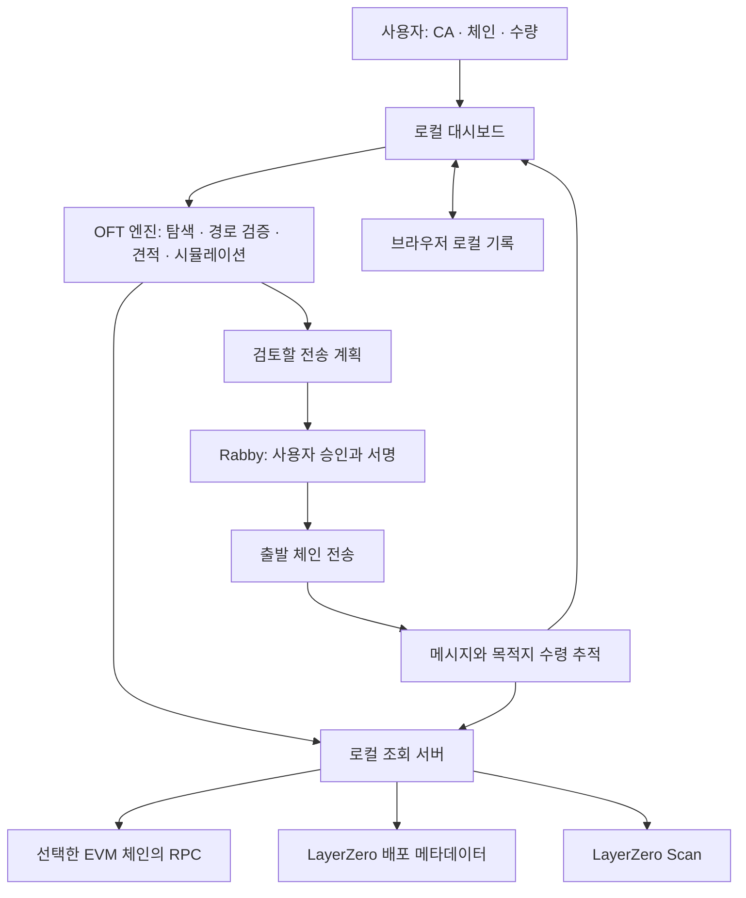

# OFT 개인용 대시보드: 아키텍처와 마일스톤

작성일: 2026-09-06

이 문서는 구현을 위한 설계안이다. 기존 조사는 [OFT 기술 메모](OFT_TOOL_RESEARCH.md), 실제 전송 재현 자료는 익명화한 [DOS 사례 fixture](../tests/fixtures/dos-bsc-ethereum.json)를 참고한다. 마일스톤 완료 여부는 기능과 검증 결과로 판단하며, 아래 목록이 곧 구현 완료를 의미하지 않는다.

**M0–M6 완료**: 실제 Rabby에서 양방향 소액 전송·수령·최종 확정과 새로고침 후 이력 유지를 확인했다. 무료 RPC 기반 로컬 개인용 1차 버전의 완료 범위와 추가 확장 범위를 구분한다. 마일스톤별 실전 검증 기록은 지갑 주소·거래 해시가 포함돼 공개 레포에서 제외했다.

## 1. 확정된 요구사항과 남은 선택

| 항목 | 결정 | 상태 |
|---|---|---|
| 사용 환경 | 사용자 PC에서 실행하는 개인용 대시보드 | 사용자 확정 |
| 초기 체인 | BSC ↔ Ethereum Mainnet | 사용자 확정 |
| 지갑 | Rabby 브라우저 확장, 사용자 지갑 연결 | 사용자 확정 |
| 사용자 입력 | 토큰 CA, 출발 체인, 도착 체인, 수량 | 기존 흐름 반영 |
| 실행 방식 | 필요 approve와 send를 Rabby에서 사용자가 직접 서명 | 사용자 요구 반영 |
| 실전 시험 | 대시보드 준비 후 사용자가 직접 소액 시험 전송 | 사용자 확정 |
| 0개 전송 | 필수 과정으로 넣지 않음 | 사용자 확정 |
| 초기 토큰 구현 | 일반 V2 OFT·OFTAdapter. Stargate 자체 Pool 경로는 초기 범위에서 제외 | 사용자 사용 목적 재확인 반영 |
| 어댑터 미발견 시 | 미발견 명시, 브릿지 주소 직접 입력 또는 성공 거래 해시로 후보 추출 | 사용자 확정 |
| RPC | 무료·공개 RPC 기본 사용. 장애 시 RPC 오류 명시, 사용자가 체인별 RPC 직접 입력 | 사용자 확정 |

다음 기술 선택은 이 환경에 대한 구현 권장안이다. 프레임워크 선택 자체에 별도 사용자 판단을 요구하지 않는다. 사용자 답변으로 제품 범위가 바뀌면 관련 모듈과 마일스톤을 조정한다.

사용자는 Stargate 화면에서 이미 이용 가능한 경로를 위해 이 대시보드를 만들 필요는 없다고 설명했다. 따라서 프론트 미지원 OFT 경로의 직접 조회·검증·전송에 집중한다. Stargate 자체 Pool 지원 여부는 추가 결정 대기 항목에서 제거한다. 프론트 미등록 여부를 매번 확인해야만 도구를 사용할 수 있게 제한하는 뜻은 아니다.

OFTAdapter가 보관하는 원본 토큰 잔액은 Stargate 자체 유동성 Pool과 구분한다. 일반 OFT의 burn/mint 경로에는 목적지에 미리 쌓인 토큰 잔액이 필요하지 않을 수 있고, lockbox로 돌아가는 경로에는 해제할 잔액을 확인해야 한다. 온체인 경로 존재와 프론트 등록은 별개다. [OFT 구조](https://docs.stargate.finance/primitives/routes/oft), [프론트 등록 절차](https://docs.stargate.finance/ecosystem/list-on-stargate)

## 2. 전체 구조

브라우저에서 OFT 분석·파라미터 구성을 수행하고, 로컬 서버는 외부 조회를 중계한다. 자금 이동 요청은 브라우저가 선택한 Rabby provider에 전달한다.

새 브릿지 컨트랙트를 배포할 필요 없이 기존 OFT·어댑터를 직접 호출하는 구조다. 서명키는 Rabby가 관리한다. 로컬 조회 서버에는 서명·approve·send 실행 기능을 두지 않는다.

### 권장 기술 구성

| 계층 | 권장 구성 | 목적 |
|---|---|---|
| 화면 | React + TypeScript + Vite | 입력, 검사 결과, 전송 검토, 진행 상태 |
| 지갑 상태 | wagmi + EIP-6963 Rabby 탐색 | 연결, 계정·체인 변화, 지갑 요청 |
| 온체인 처리 | viem | ABI, bigint, 읽기 호출, 견적, 시뮬레이션 |
| 조회 상태 | TanStack Query | 요청 상태, 캐시, 재시도, 입력 변경 시 무효화 |
| 로컬 조회 서버 | Node.js + TypeScript + Hono | RPC·메타데이터·Scan 중계와 응답 제한 |
| 로컬 기록 | IndexedDB | 사용자 선택, 수동 배포 정보, 진행 중·완료된 전송 |
| 개발 검증 | 단위 검사 + 로컬 EVM 테스트 + 브라우저 흐름 확인 | 금액 계산·실패 처리·지갑 요청 순서 검증 |

Rabby의 공식 문서는 EIP-6963를 통한 `io.rabby` provider 선택을 설명한다. wagmi도 여러 injected provider 발견을 지원한다. Rabby만 연결하는 첫 버전에서는 WalletConnect와 별도 다중 지갑 모달을 필수 의존성으로 추가하지 않는 것을 권장한다. [Rabby 연동 문서](https://rabby.io/docs/integrating-rabby-wallet), [wagmi 설정](https://wagmi.sh/react/api/createConfig)

라이브러리 버전은 M1에서 호환성을 확인하고 lockfile로 고정한다. Rabby 예제의 과거 wagmi API와 현재 wagmi API를 섞지 않는다. 로컬 실행·번들링은 [Vite](https://vite.dev/guide/), Node 조회 서버는 [Hono Node 가이드](https://hono.dev/docs/getting-started/nodejs)를 기준으로 구성한다.

### 로컬 서버의 범위

- 개발 시 브라우저는 하나의 로컬 origin을 사용하고 `/api` 요청을 로컬 Node 서버로 중계한다. 배포용 로컬 실행에서는 빌드한 정적 화면과 조회 API를 한 서버에서 제공할 수 있다.
- `127.0.0.1`에 바인딩하고, 허용한 origin·RPC 메서드·체인만 처리한다.
- 체인 ID로 등록된 RPC를 선택한다. 임의 외부 URL을 받는 범용 공개 프록시를 만들지 않는다.
- 브라우저 CORS 제약과 RPC 장애를 처리한다. 등록된 EVM 체인에 무료·공개 RPC 목록을 두고 제한된 횟수로 다른 공개 RPC를 시도한다.
- 무료·공개 RPC로 필요한 조회를 끝내지 못하면 `RPC 오류 — [네트워크] 조회를 완료하지 못했습니다`를 표시한다. `다시 시도`와 `RPC 직접 입력`을 제공하며 유료 RPC 가입을 요구하지 않는다.
- RPC 직접 입력은 출발·도착 체인 각각 지원한다. 연결과 chainId를 확인한 뒤 해당 체인의 조회에 적용하고 이전 견적·검증을 무효화한다. 다른 체인의 응답이면 `RPC 오류 — 선택한 네트워크와 일치하지 않습니다`로 안내한다.
- 사용자 지정 RPC는 해당 체인에서 우선 사용한다. 지정한 RPC의 실패를 표시하고, 공개 RPC로 돌아갈 수 있는 동작을 제공한다. 입력 URL은 해당 PC의 로컬 서버 설정에 보관한다.
- 타임아웃·요청 제한·연결 실패 등 RPC 장애와 컨트랙트 revert를 구분한다. 메타데이터 API 또는 LayerZero Scan만 실패한 경우에는 해당 서비스 조회 오류로 표시한다. 전송 완료 후 추적 RPC가 실패해도 거래 자체를 실패로 바꾸지 않는다.
- 읽기·시뮬레이션·가스 추정 요청만 중계한다. raw transaction 전파 메서드는 제공하지 않는다.
- 비공개 RPC 키를 브라우저 번들, 공유 자료, 기록용 로그에 넣지 않는다.
- 로그인 서비스, 클라우드 DB, 상시 인덱서 없이 시작하는 것을 권장한다.

## 3. 모듈별 책임

| 모듈 | 입력 → 출력 | 핵심 역할 |
|---|---|---|
| ChainRegistry | 체인 선택 → 검증된 체인 설정 | chainId/EID, RPC, Endpoint, 네이티브 단위, 탐색기 |
| DeploymentDiscovery | 체인·CA → 후보 목록 | 직접 OFT 탐지, 공식 메타데이터, 수동 브릿지 주소, 성공 거래 해시에서 후보 추출 |
| ImplementationResolver | 후보 → 구현 설명 | token·OFT·adapter 분리, ABI·버전·승인 여부·소수점 |
| RouteValidator | 양쪽 배포 → 검사 결과 | peer, Endpoint, 메시지 설정, DVN·Executor, 알려진 목적지 제약 |
| TransferPlanner | 경로·지갑·수량 → 전송 계획 | 정수 변환, dust, quoteOFT, 옵션, quoteSend, value |
| SimulationService | 계획·송신자 → 시뮬레이션 결과 | 잔액·allowance·가스, 실제 send 호출 시뮬레이션, 오류 해석 |
| RabbySession | 사용자 연결 → 선택한 provider·계정 | 연결, 취소, 계정·체인 변경, 전송 직전 일치 확인 |
| ExecutionController | 검토한 계획 → 승인·전송 상태 | 사용자 동작에 따른 approve/send 요청과 영수증 확인 |
| MessageTracker | source tx/GUID → 도착 증거 | Scan 조회, 목적지 tx·OFTReceived·토큰 Transfer 대응 |
| LocalStore | 선택·진행 기록 → 재개 가능한 상태 | 새로고침 후 추적 복구, 큰 정수 문자열 저장 |

체인 지원과 구현 지원을 독립적으로 관리한다. EVM 체인을 추가했다고 그 체인의 모든 OFT 변형을 지원하는 것은 아니다. 미지원 구현은 상태와 근거를 표시하고 일반 OFT로 추측해 실행하지 않는다.

### 전송 계획의 공통 데이터

`PreparedTransfer`에는 다음 정보를 보관하는 것을 제안한다.

- 연결한 지갑 provider 식별자, 송신 계정, 출발 chainId, 도착 EID.
- 출발 토큰·브릿지, 목적지 브릿지·토큰, 수신자, 환불 주소.
- 원래 입력 수량, 실제 차감·예상 수령량, minAmountLD, fee, value, 옵션, calldata.
- 구현 설명과 지원 프로필, 항목별 PASS/FAIL/UNKNOWN, 미확인 제약.
- 조회 시각·양쪽 관찰 블록, 견적과 입력의 fingerprint.
- 필요한 승인 단계와 시뮬레이션 결과, 가정한 상태 사용 여부.

계정·체인·수량·주소·옵션이 바뀌면 이전 계획은 실행할 수 없게 한다. 느리게 도착한 이전 조회 결과가 새 입력을 덮지 않도록 입력 버전과 요청 ID를 대조한다.

## 4. 사용자 실행 흐름

1. Rabby 연결. 수신자와 환불 주소는 연결 계정을 기본값으로 사용하되 데이터상 구분한다.
2. CA·출발·도착·수량 입력. 후보가 여러 개면 근거를 보고 선택한다.
3. 경로 검사 → 예상 수령량·수수료 조회 → 현재 상태 검사.
4. 승인 필요 시 승인 대상 토큰, spender, 금액을 표시하고 사용자가 Rabby에서 승인한다.
5. 승인 확정 후 잔액·allowance를 확인하고 경로·견적·send 시뮬레이션을 다시 수행한다.
6. 사용자가 최종 전송 내용을 확인하고 Rabby에서 send를 서명한다.
7. source tx를 저장하고 출발 확인 → 메시지 검증 → 목적지 수령을 추적한다.

기본 승인 정책은 필요한 금액만 승인하는 것으로 제안한다. 승인 불필요 OFT에는 approve를 요청하지 않는다. 승인 0 초기화가 필요한 토큰은 그 구현을 확인하고 순차 처리한다.

Rabby의 사용자 거절·취소는 컨트랙트 실패와 구분한다. 지갑이 요청을 접수했는지 불확실하면 자동으로 재전송하지 않고 지갑·온체인 내역을 먼저 확인한다. 지갑 서명 대기 중 네트워크를 바꾸거나 자동으로 다른 지갑 provider를 선택하지 않는다.

## 5. 마일스톤 범위와 완료 조건

범위는 **M0–M6의 7단계**로 제안한다. 일반 OFT·OFTAdapter, BSC·Ethereum, 로컬 개인용 환경을 기준으로 한 계획이다. 작업 규모는 S=제한된 연동·설정, M=여러 모듈 연결, L=프로토콜 검증과 실패 사례가 많은 작업을 뜻한다. 달력 일정이나 완료를 보장하는 수치가 아니다.

| 단계 | 범위 | 단계 종료 시 가능한 일 | 완료 기준 | 규모 |
|---|---|---|---|---|
| **M0 설계 기준 확정** | 초기 구현·탐색·RPC 정책, 모듈 계약, 화면 흐름 | 구현 범위와 제외 범위가 명확함 | 열린 선택을 기록하고 DOS 사례를 재현 자료로 연결 | S |
| **M1 로컬 앱·Rabby 기반** | 로컬 실행, 두 체인 등록, 지갑 탐색·연결, 조회 서버 | Rabby 계정·네트워크 확인과 공개 데이터 조회 | 다중 확장 상황에서 Rabby를 선택하고 계정·체인 변경·취소를 처리 | M |
| **M2 CA·어댑터 식별** | 직접 OFT, 메타데이터 검색, 후보 선택, 주소·성공 거래 해시로 보완 | CA가 어떤 토큰·브릿지에 연결되는지 표시 | DOS 양쪽의 다른 역할 식별, 거래에서 후보 추출, 미발견 명시와 조회 장애·복수 후보 구분 | M |
| **M3 양쪽 경로 검증** | peer·Endpoint·버전·라이브러리·DVN·Executor, 구현별 제약 | 출발 → 도착 경로의 검증 결과와 근거 표시 | 잘못된 peer/설정/목적지·RPC 장애·미지원 구현이 통과로 표시되지 않음 | L |
| **M4 견적·파라미터·시뮬레이션** | 수량·dust·min·옵션·수수료·value, ABI 출력, source simulation | 탐색기 입력값과 지갑 요청을 준비할 수 있음 | DOS calldata 재현, 정수 경계, 승인 대기와 시뮬레이션 실패 구분 | L |
| **M5 Rabby 전송·도착 추적** | approve→재검사→send, 영수증, GUID, 수령 확인, 기록 복구 | 대시보드에서 사용자 서명으로 전송하고 도착 확인 | 로컬 테스트 환경에서 양방향 실행 흐름·취소·중복 클릭·목적지 실패를 처리 | L |
| **M6 실사용 점검·개인용 1차 완성** | RPC 장애, 재접속, 만료·교체 거래, 사용자 소액 시험, 사용 문서 | 개인 PC에서 반복 사용 가능한 첫 버전 | M1–M5 확인 후 사용자 시험 전송과 목적지 수령 확인, 발견 문제 해결 | M |

### 단계별 세부 산출물

**M0 — 설계 기준 확정 완료**

- 이 아키텍처 문서, 결정 목록, 필수 결과 상태와 모듈 데이터 계약.
- 실전 기능을 넣기 전 사용할 공개 DOS fixture, 단위·실패 사례 목록.
- 사용자의 실제 지갑 주소나 개인키는 설계에 필요하지 않다.

**M1 — 연결과 실행 환경**

- 한 명령으로 시작하는 개발 실행과 로컬 빌드 실행 방법.
- Rabby 연결 UI, 연결 계정·선택 체인·RPC 상태 표시.
- 계정·체인 변경 이벤트에 대한 전송 계획 초기화.
- RPC fallback, 잘못된 체인 응답 차단, 메타데이터 통신 확인.
- 무료·공개 RPC 실패 문구, 체인별 직접 입력·검증·재시도, 사용자 지정 RPC 해제와 공개 RPC 복귀를 확인한다.
- 지갑 모의 provider 검사와 사용자의 실제 Rabby 연결 확인을 구분한다. 일반 자동화 브라우저에서 확장이 없다는 이유로 실제 연결 확인을 완료 처리하지 않는다.

**M2 — 미등록 토큰을 포함한 입력 처리**

- 토큰 CA와 브릿지 주소를 별도 필드로 유지.
- 참고 사이트의 `Pool 컨트랙트` 필드는 OFT·OFTAdapter 호출 주소에도 쓰이는 공통 라벨이다. 우리 화면은 `브릿지 컨트랙트`로 표기하고 구현 종류를 따로 보여준다. Stargate 자체 Pool 지원 제외가 일반 어댑터 탐색을 제외한다는 뜻은 아니다.
- CA 자동 탐색을 기본으로 제공한다. 자동으로 찾지 못하면 브릿지 주소 직접 입력 또는 성공 거래 해시로 후보 추출을 제공한다. 별도의 상시 활동 인덱서 구축까지 포함하는 결정은 아니다.
- 성공 거래의 해시 또는 선택한 체인의 스캔 링크를 입력받는다. 이번 출발 체인에서 발생한 직접 OFT send 거래 또는 OFT 수신 거래를 조회한다. 직접 send는 입력·OFTSent를 대조하고, 수신 거래는 OFTReceived·공식 Endpoint의 PacketDelivered·계산한 GUID·입력 토큰 Transfer를 대조한다. 이후 현재 OFT 인터페이스와 token() 관계를 다시 검사한다. 거래의 최상위 to를 무조건 브릿지로 채우지 않는다. 해석할 수 없는 라우터 송신·비표준 수신 거래는 사유를 표시한다. 과거 거래의 수량·수수료·수신자를 새 전송에 자동 적용하지 않는다. 과거 수신 출발 EID와 이번 목적지는 달라도 되며, 현재 요청한 경로는 M3에서 별도 검증한다.- `token()`, `approvalRequired()`, decimals, sharedDecimals, OFT 메시지 버전 조회.
- 수동 주소도 자동 발견 주소와 동일한 검사를 거친다.
- metadata 미등록, 조회 장애, 일반 ERC-20, 여러 adapter 후보를 다른 상태로 표시.
- 발견 출처와 해당 프로젝트 배포라는 근거를 따로 보관한다. 함수가 응답한다는 사실만으로 공식 배포라고 표시하지 않는다.

**자동 탐색 결과의 필수 화면 표시 — 사용자 확정**

| 상태 | 표시 문구와 동작 |
|---|---|
| 조회한 자료에서 후보 없음 | **Pool 컨트랙트를 찾지 못했습니다.** 보조 설명: 현재 조회한 정보에서 브릿지 주소를 찾지 못했으며, 브릿지가 불가능하다는 뜻은 아닙니다. |
| RPC 오류로 탐색 미완료 | **RPC 오류 — [네트워크] Pool 컨트랙트를 확인하지 못했습니다.** 재시도와 해당 체인 RPC 직접 입력을 제공한다. |
| 메타데이터 API 오류로 탐색 미완료 | **메타데이터 조회 오류로 Pool 컨트랙트 탐색을 완료하지 못했습니다.** 실패한 조회와 재시도 수단을 표시한다. RPC 오류와 구분하며 일부 조회 실패를 확정적인 미발견으로 처리하지 않는다. |
| 여러 후보 발견 | **Pool 컨트랙트 후보가 여러 개입니다.** 후보별 출처·구현·토큰 연결을 표시하고 선택받는다. |
| 후보 발견 | 주소와 구현 종류를 표시한다. 목적지 경로 검증 결과는 별도 표시한다. |

미발견·조회 실패 화면에서 `브릿지 주소 직접 입력`, `성공 거래 해시로 찾기`를 제공한다. CA·체인을 바꿔 새로 탐색하면 이전 브릿지 주소·경로·견적·실행 계획을 무효화한다. 현재 입력의 브릿지 후보가 확정되지 않은 상태에서는 전송할 수 없다. M2 완료 조건에는 위 문구 표시와 이전 주소가 남지 않는 동작 확인을 포함한다.

**M3 — 경로 검증**

- 양쪽 peer와 effective 라이브러리·검증 설정 확인.
- DVN은 체인별 컨트랙트 주소가 다를 수 있다. 두 체인의 주소 배열을 문자 그대로 비교하지 않고 공식 배포 매핑과 요구 조건을 해석한다.
- 목적지 어댑터 해제 잔액, 지원하는 구현의 pause·한도 등 필요한 조건 검사.
- 커스텀 조건을 확인할 수 없으면 미확인 항목과 지원 한계를 남긴다. 모든 표준 인터페이스 응답을 받았다고 목적지 실행을 보장하지 않는다.
- `PASS / FAIL / UNKNOWN / NOT_APPLICABLE` 및 검사별 출처·시각·블록 표시.

**M4 — 정확한 전송 요청 준비**

- 금액·슬리피지는 문자열과 정수로 처리하고 수령 단위를 명시한다.
- quoteOFT로 수령량을 읽고 최종 파라미터로 quoteSend를 호출한다.
- caller 옵션과 enforced 옵션을 함께 해석한다. 가스 추천 근거가 없는 커스텀 경로는 충분하다고 추정하지 않는다.
- tuple, 개별 필드, calldata, value, 승인 요청 계획을 내보낸다.
- 현재 잔액·allowance가 충족되면 실제 account/value를 넣어 source send를 시뮬레이션한다.
- 승인 전 실패는 준비 상태로 분리한다. 상태를 가정한 시뮬레이션은 별도 표시하며 실제 승인 후 재검사를 대체하지 않는다.

M4 구현 결정: 상태 override는 사용하지 않는다. Type 3 lzReceive(gas, value=0)와 ordered 옵션을 해석하며, nativeDrop·compose·read·별도 worker 옵션은 미지원 이유를 표시한다. 기본 추가 gas는 0이며 강제 옵션에도 gas가 없으면 사용자 입력이 필요하다. quoteOFT의 실제 수령량에서 슬리피지 최소치를 계산하고, 최종 최소치를 적용한 quoteOFT와 quoteSend를 같은 출발 블록에서 읽는다. 유효 시간은 조회 시작부터 60초다.
**M5 — 사용자 서명과 추적**

- UI의 검토 내용과 지갑 요청의 chainId/from/to/value/calldata가 일치하는지 확인.
- 승인 확정 후 재견적·재시뮬레이션, 서명 거절·실패·중복 실행 상태 처리.
- source tx/GUID 저장, Scan의 여러 메시지 중 대상 선택, 목적지 이벤트 확인.
- 새로고침·지갑 연결 해제 후에도 저장된 공개 tx의 추적을 재개한다.
- RPC 전파 결과가 불확실하거나 pending 상태인 전송을 자동 재실행하지 않는다.
- 이 단계 종료는 로컬 테스트 환경에서의 기능 완성이다. 실제 mainnet 수령 확인은 M6에 남긴다.

M5 구현 결정: 최신 견적을 별도 검토 화면에 표시한 후 명시적 클릭으로 한 건만 Rabby에 요청한다. 부족한 비영(非零) allowance는 먼저 0으로 초기화하고 각 확정 후 다시 검증한다. 서버 RPC는 계속 읽기 전용이며 서명·전파는 Rabby provider만 수행한다. IndexedDB에 요청을 먼저 예약하고 동일 계정·체인의 미확정 요청을 차단한다. Scan 결과는 GUID·양쪽 EID/브릿지·출발 해시로 선택하며, 목적지 이벤트와 토큰 이동·수령량·양쪽 finalized 블록을 직접 확인해야 완료로 표시한다.
**M6 — 실제 사용 검증**

- 연결·API 실패, 서버 재시작, 메타데이터 만료, 브라우저 새로고침, 거래 replacement/cancel을 확인.
- 사용자가 소액 시험을 직접 실행하고 목적지 수령을 확인한다. 토큰 가치와 네트워크 수수료를 구분한다.
- 양방향 지원은 두 방향의 조건을 각각 확인한다. 과거 BSC → Ethereum 사례만으로 역방향 실전 확인을 완료 처리하지 않는다.
- 사용자 시험이 남아 있다면 `개발 검증 완료 / 사용자 실전 확인 대기`로 기록한다.
- 로컬 시작·종료, RPC 설정, 실패 사유 확인, 전송 이력 복구 방법을 문서화한다.

## 6. 예상 릴리스 범위

| 구간 | 포함 범위 | 사용자에게 제공되는 결과 |
|---|---|---|
| M1–M3 | 로컬 조회·Rabby 연결·경로 검증 | CA로 연결 구조와 검사 결과를 확인하는 버전 |
| M4까지 | 견적·인자 생성·출발 시뮬레이션 | 기존 탐색기 수동 준비를 대체하는 버전 |
| M5까지 | Rabby approve/send·도착 추적 | 사용자 시험이 가능한 기능 완성 버전 |
| M6까지 | 오류 처리 보강·사용자 소액 시험·운영 문서 | 개인용 1차 완성 버전 |

의존성은 기본적으로 `M0 → M1 → M2 → M3 → M4 → M5 → M6`이다. 금액·ABI 등의 독립 계산 검사는 구현 중 먼저 작성할 수 있지만, 실제 지갑 전송을 제공하는 시점에는 선행 검증이 갖춰져야 한다.

작업량이 가장 큰 부분은 M3–M5다. 새로운 OFT 변형, 커스텀 메시지 라이브러리, RPC 접근 제한을 발견하면 해당 지원 범위를 재산정한다. 일반 OFT 전체에 대해 근거 없는 완료 예정일을 먼저 고정하지 않는다.

## 7. 첫 버전의 구현 기본 정책

아래는 기존 사용 목적에 맞춰 적용할 구현 기본값이다. 모두 사용자가 개별 확정한 선택이라는 뜻은 아니며, 사용자 지시가 있으면 변경한다. 이 항목들을 추가 승인 대기 조건으로 두지 않는다.

| 항목 | 권장 기본값 |
|---|---|
| 수신·환불 주소 | 연결 지갑, 필요 시 고급 항목에서 별도 입력 |
| amount | 사용자가 입력. 과거 거래나 테스트 금액 자동 재사용 없음 |
| 최소 수령량 | 현재 견적에 사용자 슬리피지를 반영. 입력 수량과 무조건 동일 처리하지 않음 |
| 슬리피지 | 초기 0 bps, 견적 수령량 기준. 사용자가 변경하면 새 계획 생성 |
| approve | 실제 `approvalRequired`에 따라 필요한 금액만 |
| 목적지 실행 가스·옵션 | 컨트랙트의 enforced 설정과 지원 구현을 기준으로 구성. 근거 없이 성공 거래의 가스값을 충분하다고 단정하지 않음. 자동 구성 근거가 부족하면 사유 표시 |
| 고급 입력 | 수신 주소·슬리피지와 지원하는 실행 옵션은 고급 영역에서 변경 가능. 변경 후 견적·검증·시뮬레이션을 새로 수행. raw calldata로 검증을 우회하는 실행은 제공하지 않음 |
| 견적 갱신 | 계정·체인·RPC·수량·옵션 변경 시 무효화하고 승인 후 및 전송 요청 직전에 다시 조회 |
| compose/native drop | 첫 기본 화면에서 제외, 일반 send 중심 |
| 미확인 필수 검사 | 이유와 해결 방법 표시. 실행 준비 완료로 승격하지 않음 |
| 단순 파라미터 출력 | 진단용 출력을 허용하되 검증 범위·실행 준비 상태를 함께 표시 |
| 재전송 | 사용자가 상태를 확인한 뒤 새로 요청. 자동 반복 전송 없음 |
| 저장 | 브라우저 로컬 전송 기록, 비밀이 없는 설정만 |
| 메타데이터 | 캐시와 수동 입력을 함께 사용. 미등록을 미지원으로 단정하지 않음 |

## 8. 확장 시 추가되는 범위

| 선택 또는 후속 기능 | 추가 작업 | 영향 |
|---|---|---|
| Stargate 자체 Pool 경로: 초기 범위 제외 | 나중에 별도 필요가 생기면 전용 처리기, 유동성·경로 credit·토큰 수수료·value·옵션 분기 | 현재 M0–M6에 포함하지 않음 |
| 활동 이력 인덱서 | 범위·시작 블록·재시도·재구성·중복 처리, 지속 저장소, 후보 근거 | 별도 후속 마일스톤 권장. CA 역조회 완전성을 보장하지 않음 |
| 추가 EVM 체인 | 체인 설정·RPC·fee model·지갑 지원과 양쪽 경로 사례 확인 | 네트워크별 검증 후 활성화 |
| 비EVM·이전 OFT | 주소·메시지·지갑·시뮬레이션 처리기 | 별도 설계 범위 |
| 공개 웹 서비스 | 호스팅·접근 제어·비용 제한·서버 저장·운영 | 현재 로컬 구조의 후속 작업 |

## 9. 결정 상태와 구현 중 확인할 사항

사용 환경·초기 체인·지갑·지원 범위·탐색 보완·RPC 정책에 대한 사용자 답변을 반영했다. **현재 구현 착수를 위해 추가로 답변받아야 할 필수 제품 선택은 없다.**

추가 사용자 결정 없이 진행할 구현 사항:

- 기술 스택과 라이브러리 호환 버전 고정, 모듈 데이터 형식, 오류 상태와 요청 재시도 정책.
- 연결 지갑을 기본 수신·환불 주소로 사용, 필요한 수량 승인, 견적 기준 슬리피지 0, 고급 옵션 변경 후 재검사.
- 무료 RPC 실제 접근성과 메서드 지원 확인, 메타데이터 응답 형식 확인. URL 목록은 구현 시 검증한다.

구현 중 실제 배포를 확인해야 하는 기술적 불확실성:

- 일반 OFT와 다른 수수료·전송 한도·민팅 권한 등 커스텀 동작이 발견될 수 있다. 일반 처리로 해석할 수 없으면 이유를 표시하고 사례별로 확인한다.
- enforcedOptions만으로 필요한 실행 조건이 충족되는지, 별도 caller 옵션이 필요한지는 경로별로 확인한다. source 시뮬레이션은 목적지 실행 성공을 보장하지 않는다.
- 무료 RPC의 과거 거래·로그 접근 범위와 Scan 인덱싱 지연은 실제 연동 단계에서 확인한다. 조회 불가를 브릿지 불가 또는 거래 실패로 단정하지 않는다.

이러한 사실 확인이 지원 범위를 바꾸거나 새 비용·새 사용자 흐름을 필요로 할 때만 구체적인 결과와 함께 추가 선택을 요청한다. 기술 구현의 세부 선택을 위해 같은 질문을 반복하지 않는다.

실제 Rabby 확장 연결 확인은 사용자가 평소 사용하는 브라우저에서 해당 단계에 수행한다. 지갑 주소나 별도 RPC URL은 지금 제공할 필요가 없다. 제공된 DOS 거래 자료로 초기 디코딩 검증을 시작할 수 있다.

## 10. 문서 간 우선순위

이 문서의 사용자 확정 사항과 이후 명시적 답변이 이전 조사 문서의 미확정 제안보다 우선한다. 지원 범위를 바꾸면 마일스톤과 완료 조건을 함께 수정한다. 설계에 적힌 기능과 실제 완료한 구현을 구분하며, 구현·지갑 확인·실전 전송 여부는 별도의 마일스톤 상태와 검증 보고서에 기록한다.

## M7 다중 EVM 확장 — 2026-09-07 추가

M0–M6 초기 범위를 확장했다.

1. 정적 Chain ID/EID/공식 배포 레지스트리 → 독립적인 출발·도착 검색 → 선택한 두 체인만 RPC 조회.
2. 같은 레지스트리를 Rabby 설정, CA/거래 탐색, 경로 검증, 저장 후보·이력에서 사용. live 메타데이터는 체인별로 검증하여 한 체인의 결함이 나머지를 중단시키지 않는다.
3. `network-execution.ts`가 일반 EVM·Arbitrum·OP 비용 모델과 finalized 조회를 담당. 견적·승인·서명 직전 검사에서 공유한다. 추가 비용 예산은 OFT value와 분리한다.
4. 별도 검토가 필요한 55개 체인은 조회 전용. 111개 목록 등록은 전체 체인/토큰의 전송 성공 보장이 아니다. 기존 BSC/ETH 이력의 저장 형식은 유지한다.
